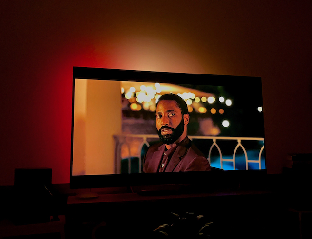
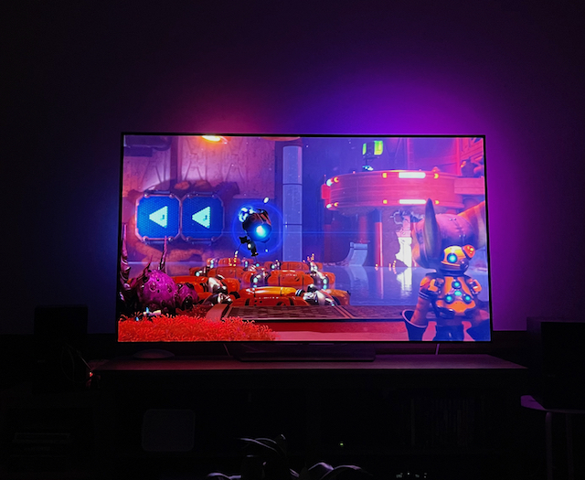
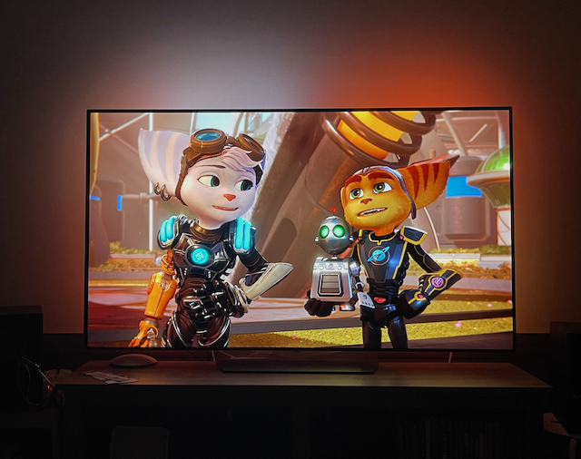
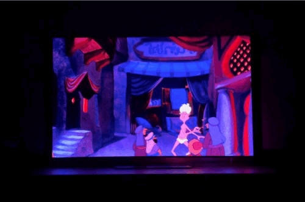

#  Ambilight-Client

Ambilight is a content-aware LED installation that provides back-illumination
for a TV.

This repository contains source for the ESP32-based client device. A separate Ambilight server device sends data to the client and consists of a Raspberry Pi with a camera pointed at the TV. The server and client  communicate via UDP.

## Definitions
Server = Raspberry Pi with camera ([ambilight-server](https://github.com/kojigardiner/ambilight-server))

Client = ESP32 device (ambilight-client or [audiobox](https://github.com/kojigardiner/audiobox))

## Protocols
Messages are defined and serialized using [nanopb](https://github.com/nanopb/nanopb) and compiled for C (ambilight-client) and Python (ambilight-server). Definitions are stored in a [separate repository](https://github.com/kojigardiner/ambilight-proto).

## UDP Network
### Discovery
1. Server starts a timer and sends a broadcast message continuously until
timeout.
2. Clients that hear the broadcast start a timer and continuously respond until
timeout with the following:
    * IP address
    * Port
    * Type (audiobox, ambilight-client)
    * Number of LEDs
    * LED format (serpentine grid, rectangular perimeter, ...)
3. Server stores each client's info in a dict and continuously sends ACKs until
the timeout.
4. Clients that receive an ACK stop responding
5. Server/clients stop after timeout.

### Sending Data
1. Server sends data
    * Sequence #
    * Server timestamp
    * LED RGB array
      * for ambilight, this will be TV data
      * for audiobox, this will be images, animations, etc
2. (Optional) Clients ACK every received transaction
    * ACK
    * Sequence #
    * Client timestamp

## Control Schemes
1. Web server on Raspberry Pi (ambilight-server)
    * Admin server used to adjust camera position and debug client connections.
2. Web server on ESP32 (ambilight-client)
    * Similar to the audiobox controller, this will allow simple on/off controls and
  mode changes (e.g. TV mode vs solid color modes).

## State Machines
### Client
*State: START*
- Behavior: Setup UDP port to receive broadcast messages.
- Transition: Once setup, transition to IDLE.

*State: IDLE*
- Behavior: Listen for discovery message.
- Transition: On receipt of discovery message, store server's IP/port, start
timer for DISCOVERY_MS, and transition to DISCOVERY state.

*State: DISCOVERY*
- Behavior: Send config packets every DISCOVERY_CONFIG_MS.
- Transition: On receipt of ACK, transition to DATA state. If no ACK is
received before timeout, transition to IDLE state.

*State: DATA*
- Behavior: Listen for data messages and parse. If the sequence number is larger 
than the last received, immediately send to LEDs and update the last seen
sequence number.
- Transition: On receipt of discovery message, transition back to IDLE state in
order to re-establish connection.

### Server
*State: DISCOVERY*
- Behavior: Start DISCOVERY_MS timer. Send discovery packets every 
DISCOVERY_BROADCAST_MS. Listen for config packets, and when received, add 
client's information to dictionary and send ACK.
- Transition: On timeout, transition to DATA state.

*State: DATA*
- Behavior: If data is available, send it to all clients in the dictionary.
- Transition: None

## Animations

